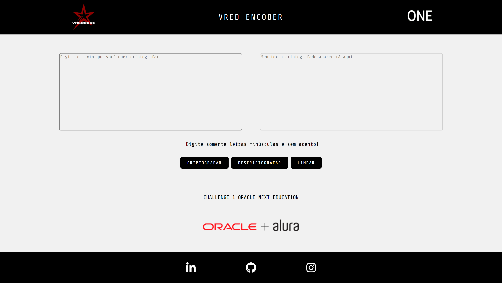

# 
:lock: VRed Encoder :old_key::unlock:

 
### 
:red_circle: Challenge 1 do Programa Oracle Next Education (ONE) :red_circle:

___
___
### :bookmark_tabs: Descrição:

Este sistema foi criado como parte da formação em desenvolvimento full stack ministrada pela escola de programação Alura em parceria com a Oracle (Oracle Next Education - ONE). O design, os elementos e o script do projeto são de autoria própria, tendo sido fornecido informado pelo programa apenas os dados de saídas necessários ao executar o sistema, bem como a descrição do "problema" a ser resolvido.

As tecnologias utilizadas para desenvolver esse projeto foram:  HTML, CSS, JavaScript, GIT e GitHub.

### capital_abcd: Descrição dos padrões de encriptação:

- `Vogal a: `Transforma em : ai
- `Vogal e: `Transforma em : enter
- `Vogal i: `Transforma em : imes
- `Vogal o: `Transforma em : ober
- `Vogal u: `Transforma em : ufat
___
###  
:computer:Prévia do projeto web.:computer:

]
___
###  
:iphone:Prévia do projeto mobile.:iphone:

[]
___
### 
:point_down::point_down::point_down:
 

### 

